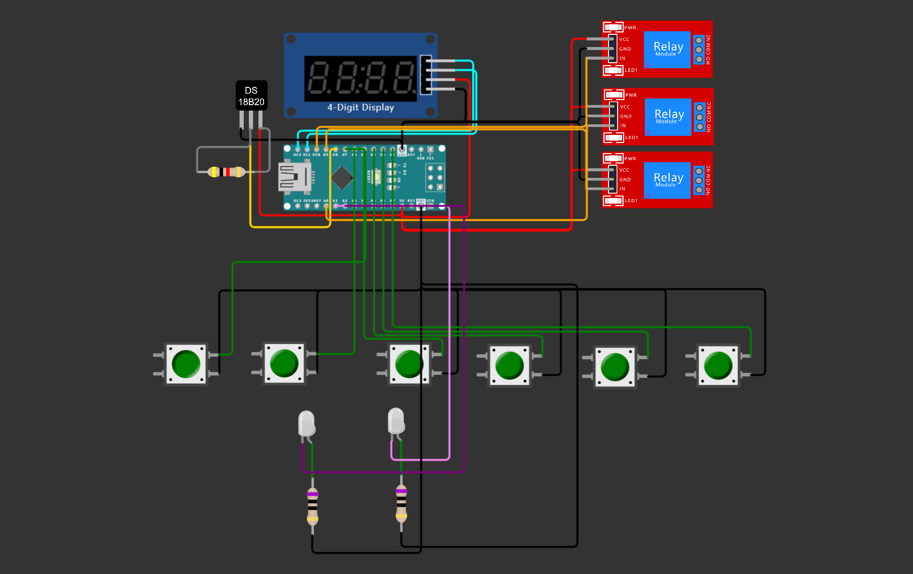

<p align="center">
   
</p>

<p align="center">
    
    
    
     


</p>

## Content
1. [Overview](https://github.com/yevheniisukhominskiy/Dehydrator#overview)
2. [Documentation](https://github.com/yevheniisukhominskiy/Dehydrator#documentation)
   1. [Device selection](https://github.com/yevheniisukhominskiy/Dehydrator#device-selection)
   2. [Connection](https://github.com/yevheniisukhominskiy/Dehydrator#connection)
   3. [Modules](https://github.com/yevheniisukhominskiy/Dehydrator#modules)
3. [Distribution](https://github.com/yevheniisukhominskiy/Dehydrator#distribution)
4. [Developers](https://github.com/yevheniisukhominskiy/Dehydrator#developers)
5. [License](https://github.com/yevheniisukhominskiy/Dehydrator#license)
6. [Warning](https://github.com/yevheniisukhominskiy/Dehydrator#warning)


## Overview

A dehydrator is an exceptional drying device that doesn't just dry fruits and vegetables but does so evenly, with high quality, and at a specified temperature.

Dehydrators are also known as drying machines. Their principle of operation is quite simple. Inside the chamber, there is a heating element that generates heat, and a fan evenly distributes this heat. As a result, when placed in the device for an extended period, the products lose moisture without undergoing roasting or baking.

## Documentation

### Device selection
The project was developed based on the LGT8F328P-LQFP48 microcontroller. This microcontroller offers a range of features and capabilities that make it suitable for a vegetable dehydrator project. Starting from version 2.1, support for the STM platform is available.

To select the device for the Vegetable Dehydrators project in PlatformIO, follow these steps:
1. Open the platformio.ini file.
2. Paste the code based on your device.

### LGT8F328P
```ini
[env:lgt8f328p-LQFP48]
platform = lgt8f
board = lgt8f328p-LQFP48
framework = arduino
lib_deps = 
	milesburton/DallasTemperature@^3.11.0
	gyverlibs/EncButton@^3.0
	gyverlibs/GyverTM1637@^1.4.2
```

### STM32F103C8T6 Blue Pill
```ini
[env:bluepill_f103c8]
platform = ststm32
board = bluepill_f103c8
framework = arduino
upload_protocol = serial
lib_deps = 
	milesburton/DallasTemperature@^3.11.0
	gyverlibs/EncButton@^3.0
	gyverlibs/GyverTM1637@^1.4.2
```

### Connection


Connection view is available [here](https://wokwi.com/projects/new/arduino-nano)
#### Buttons
| **Microcontroller** | **BUTTON-START** | **BUTTON-TEMP** | **BUTTON-TIMER** | **BUTTON-PLUS** | **BUTTON-PLUS** | **BUTTON-BLACKLIGHT** |
|---------------------|-----------------|------------------|------------------|-----------------|-----------------|-----------------------|
| 5V                  | D7              | D6               | D5               |	D4			    | D3              | D2                    |
| GND                 | GND             | GND              | GND              | GND             | GND             | GND                   |

#### Leds for button
| **Controller** | **LED-TEMP** | **LED-TIMER** |
|----------------|--------------|---------------|
| PIN            | A1           | A2            |
| GND            | GND          | GND           |

#### Relays
| **Controller** | **RELAY-HEATER** | **RELAY-COOLER** | **RELAY-LEDS** |
|----------------|------------------|------------------|----------------|
| 5V             | VCC              | VCC              | VCC            |
| GND            | GND              | GND              | GND            |
| PIN            | D10              | A0               | D9             |

#### Others
| **Controller** | **DS18B20** | **TM1637** |
|----------------|-------------|------------|
| 5V             | VCC         | VCC        |
| GND            | GND         | GND        |
| PIN            | DQ -> 8     | DIO -> 11  |
| PIN            | -           | CLK -> 12  |

### Modules
* 1x Board: LGT8F328P or STM
* 1x Digital Display: TM1637
* 1x Temperature Sensor: DS18B20
* 6x Button Interface: TACT 12x12
* 2x LED Indicator: 600-800 mCd
* 3x Rele 12V
  
## Distribution
- Available only here


## Developers
- [Yevhenii Sukhominskiy]([GitHub Profile Link](https://github.com/yevheniisukhominskiy))

## License
Project Dehydrator is distributed under the MIT license.

## Warning
1. By using this project, you agree to the "Disclaimer" and take full responsibility that may be placed upon you.
2. The information provided is for users' free knowledge on topics that may be of interest to them.
3. The author is not responsible for the relevance, accuracy, completeness, or quality of the provided information. Any claims or complaints regarding material or moral damage due to the use or non-use of the information provided, including the use of incorrect or incomplete information, are entirely excluded.


